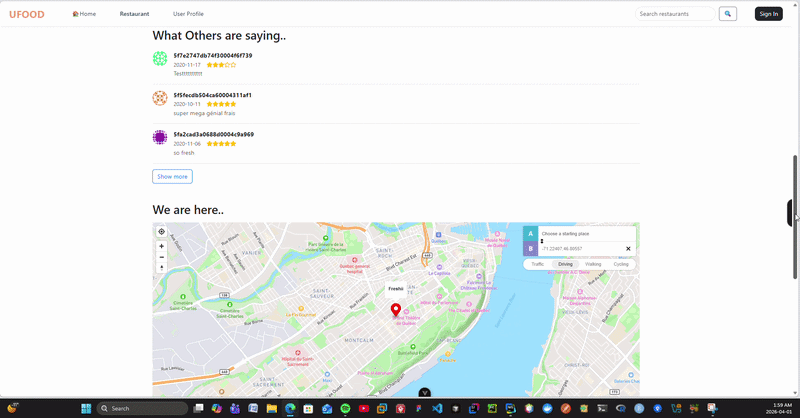
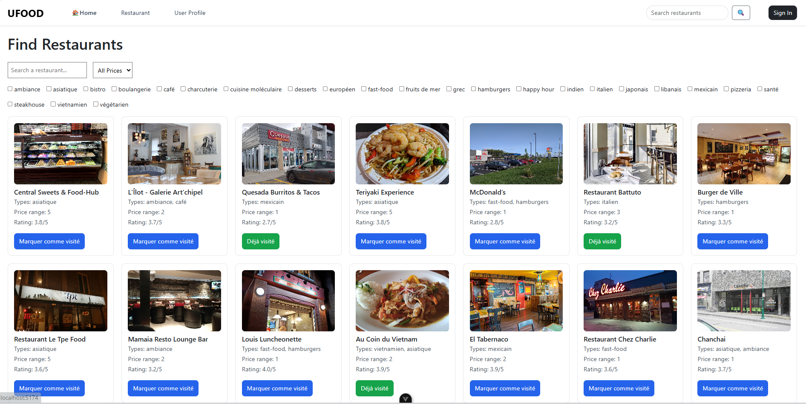
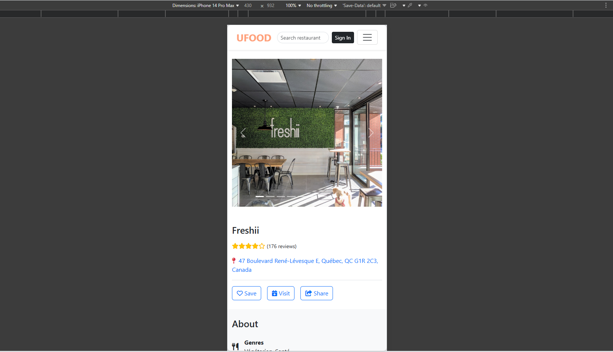

> 🇫🇷 [Lire en français](README.fr.md)

# UFood — Restaurant Discovery App

Frontend application for discovering restaurants, managing favorites, and sharing visits with friends. Built against a course-provided REST API.
Team-build app as part of the GLO-3012 Web Application Developement at Laval University (Winter 2026).

> The original course repository is private. This mirror contains only this README.

📖 [API Documentation](https://ufoodapi.herokuapp.com/docs/)

🔗 [Full Demo Video](https://youtu.be/8KJPNR0Icmk)

---
## 📹 Demo



---

## Features

**Restaurant Search & Filtering**<br>
└─ `Search restaurants by name, filter by price range and genre.`

**Restaurant Page**<br>
└─ `Full details — photos, info, hours, map with directions, reviews, recommendations, visit and favorite actions.`

**Visit Tracking**<br>
└─ `Log visits with date, rating, and comment. View past visits in read-only mode from the profile.`

**Favorites Lists**<br>
└─ `Create, edit, and delete named lists of favorite restaurants. Add or remove restaurants from any list.`

**Map Mode**<br>
└─ `Switch the home page between list view and interactive map. Search and filter work in both modes.`

**User Profiles**<br>
└─ `View recently visited restaurants, favorites lists, followers, and following. Follow or unfollow users.`

**Authentication**<br>
└─ `Login and registration with email and password. Token expiration handled automatically.`

**User Search**<br>
└─ `Search for other users directly from the navigation bar.`

---

## 📸 Screenshots

![Screenshot 1]
*Home Page Overview*



![Screenshot 2]
*Restaurant page on mobile*



---

## Tech Stack

- Vue 3, Vue Router, Axios
- Bootstrap 5
- Mapbox GL JS (map and directions)

---

## Project Structure

```
src/
├── pages/          # Home, restaurant, profile, auth pages
├── components/     # Reusable UI components
├── router/         # Vue Router config
└── services/       # Axios API calls
App.vue
main.js
```

---

## My Contributions

- Full restaurant page (photos, info, hours, visit button, favorites button, share feature)
- Interactive map with restaurant location and directions
- Restaurant reviews section
- Restaurant recommendations section

---

## Contributors

University team project — GLO-3102, Université Laval.

- **[Petiton Wiseley Paul-Enzer](https://github.com/pwiseley)**
- **[Ouedraogo Aliya Imann](https://github.com/aioue8)**
- **[Mamoudou Hamadou Mamoudou Hamadou](https://github.com/mamoudouhamadou)**
- **[Dongmeza Murielle Christelle](https://github.com/muriellec)**
- **[Kémila Bakary](https://github.com/kemilabakary)**

---

[petiton.dev](https://petiton.dev)
